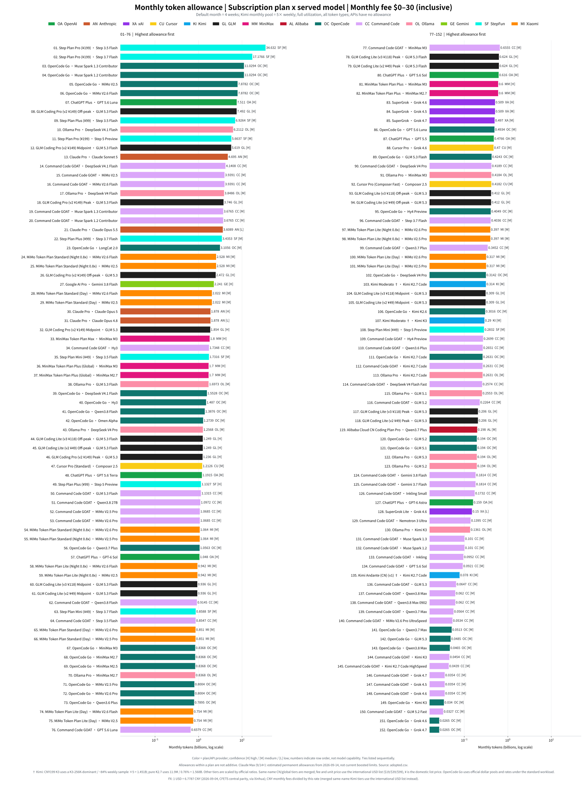
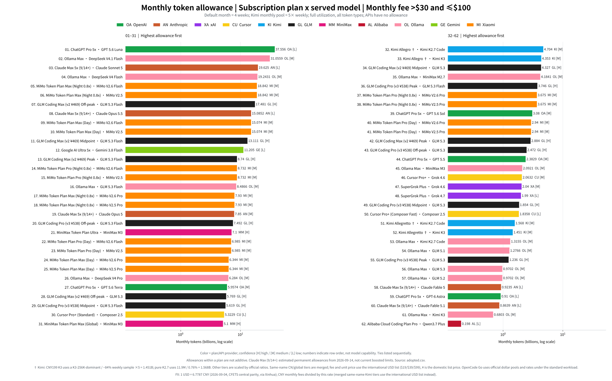
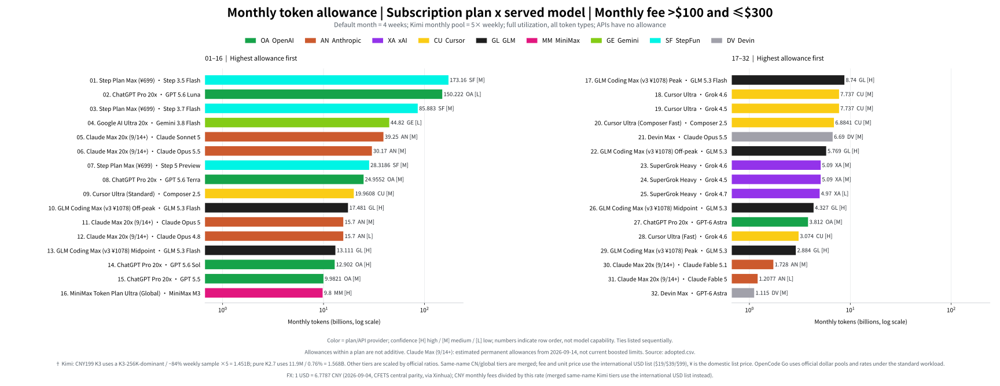
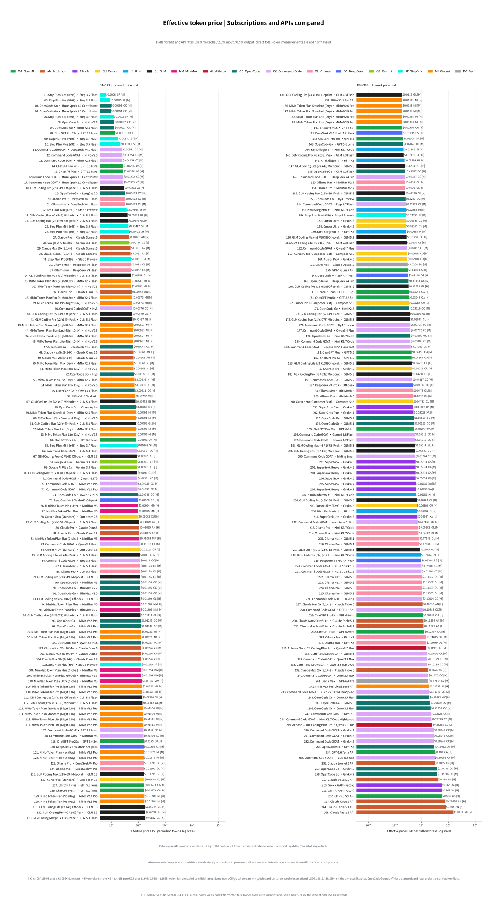
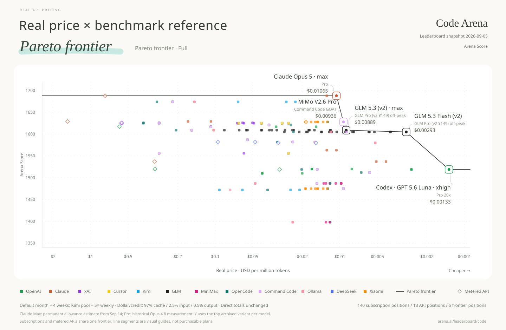
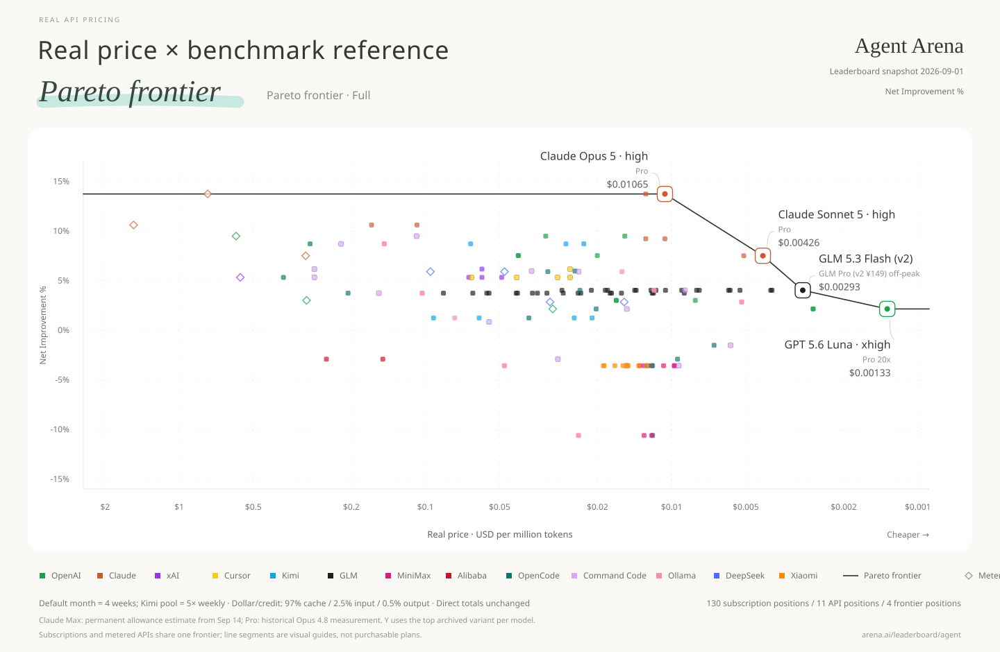
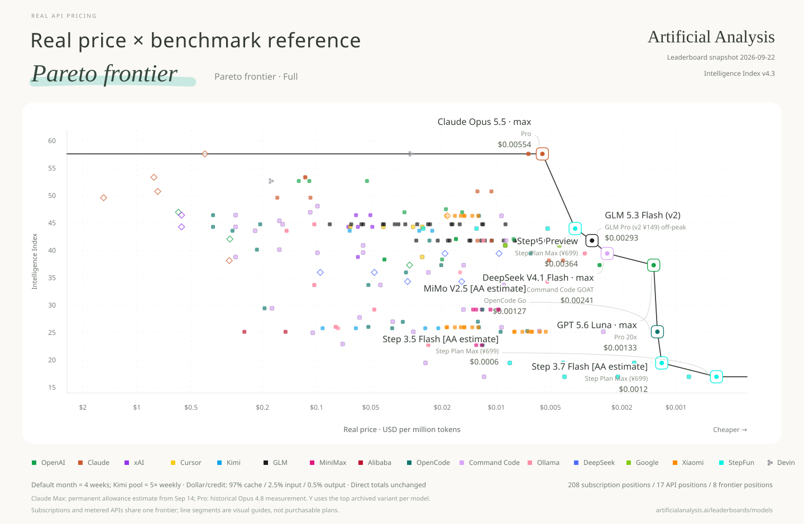
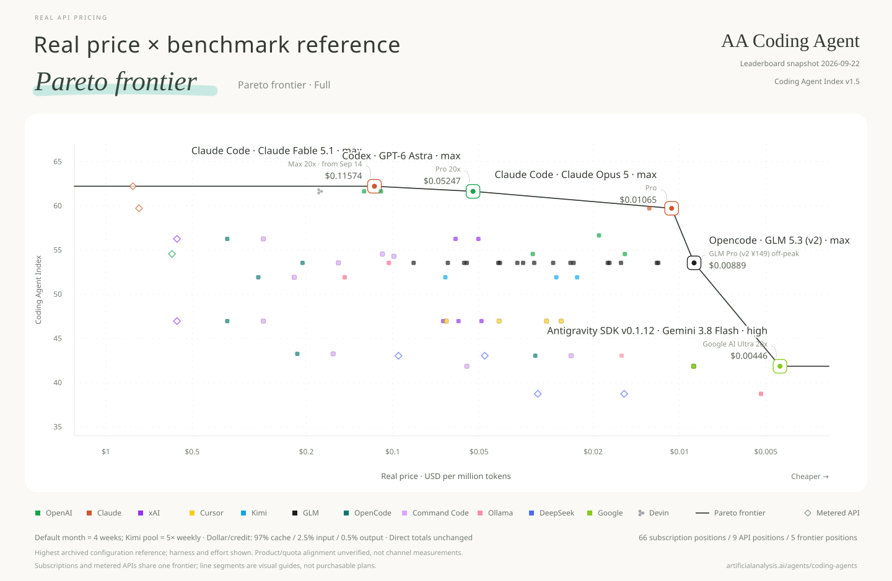
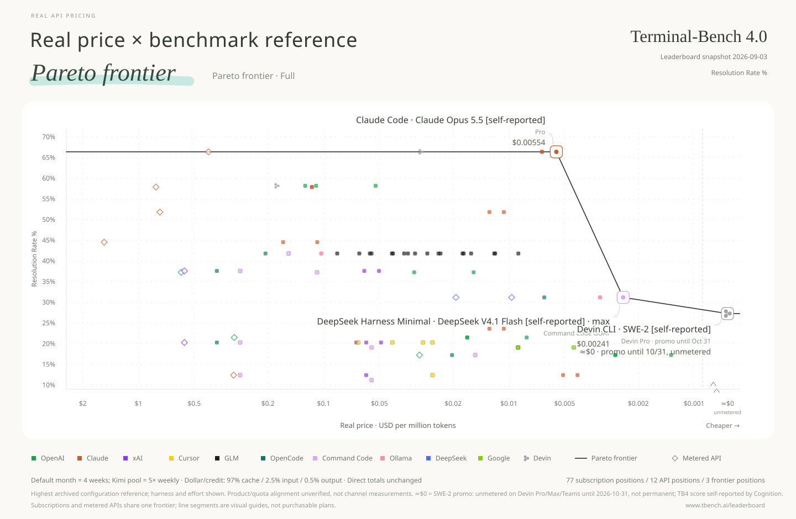
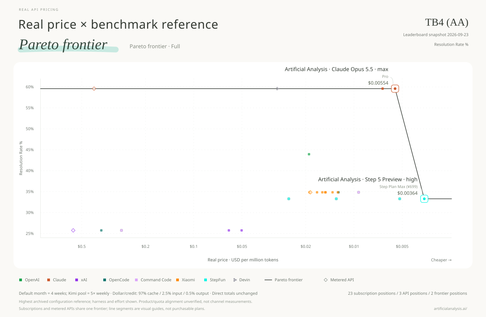

## [Explore the interactive website →](https://real-api-pricing.vercel.app)

Compare models, prices and allowances · English / 中文

**English** | [中文](README.zh.md)

# Real API Pricing

**Real unit price = monthly subscription fee ÷ monthly usable tokens.**

Full adopted data is shown first, followed by one Pareto chart per leaderboard. Monthly figures default to four weeks of saturated use; vendor-defined monthly pools remain as defined (Kimi's monthly pool is 5× its weekly pool). Input, output and cache tokens are all included. Prices use a logarithmic axis, with cheaper points farther right.

Dollar/credit pools and three-part token prices are converted with one project-wide standard workload: **97% cache reads, 2.5% fresh input, and 0.5% output**. This is a comparison convention, not a claim about any provider's actual workload. Measurements that already report total tokens—dashboard back-calculations, local usage logs, controlled saturation tests, and official absolute-token tables—are not normalized again. Where only total tokens and a cost-weighted percentage are available but the token-type split is unknown, the observed total is retained and the limitation is recorded rather than inventing a split. Cache writes are not modeled separately; where a provider charges for them, converted token allowances may be overstated. See [conventions](data/conventions.json) and the [token-mix audit](data/research/token-mix-audit-round2-2026-09-07.json).

GLM Coding Plan is recomputed from Zhipu's official weekly credits and cache/input/output coefficients under the same standard workload. Peak, midpoint and off-peak scenarios are shown separately instead of copying the official 95%-cache example table. A Caijing saturation-cost test and community evidence are consistent in scale, but there is still no fully specified independent V3 Pro/Max saturation test. See the [official-table archive](data/research/quotas-web-2026-09.json) and [community-evidence review](data/research/glm-community-round1-2026-09-07.json). Step Plan CN uses StepFun's official monthly Credit pools (1M Credit = ¥1) converted through CNY list prices under the same standard workload; the international site's USD sticker prices differ and are not adopted, and the superseded Coding Plan prompt/5h limits are retained only as evidence.

Each chart uses scores from its named leaderboard only. Code Arena here specifically means the WebDev Overall Arena Score, not general coding ability. OpenDesign Arena uses the 0–100 average task score (requirements 30 + design quality 70); its cost/speed-weighted recommendation score is not used. GPT-5.6 Luna now uses a ChatGPT Plus dashboard measurement: 112.67 million total tokens consumed about 6% of the weekly allowance, giving 7.511 billion tokens/month for Plus. The 5x and 20x plans are scaled from that measured Plus baseline, so the rightmost Luna point is 150.222 billion tokens/month at medium confidence rather than the superseded 240.24 billion Sol-credit derivation. Claude Max's 15.7 billion-token estimate applies to the permanent terms from September 14, 2026, not a promotional ceiling. Chinese charts use 100-million-token units: 77.37 in Chinese equals 7.737 billion in English.

**[All charts: English / 中文, SVG / PNG](charts/README.md)** · [English files](charts/en/) · [中文文件](charts/zh/)

## Data snapshot

AA Intelligence now uses **Intelligence Index v4.3** (announced September 7, 2026); AA Coding Agent uses **v1.5**. The new intelligence methodology replaces the old snapshot as a whole: lower numerical scores are not evidence of model regression across index versions. All configurations within the selected snapshot are retained, including explicitly marked AA estimates. Historical evidence stays in `data/research/`.

Snapshot: <!-- stat:snapshot -->2026-09-26<!-- /stat -->. Each row is one **plan × actual served model**; allowances of different models under the same plan are alternatives and must not be added together.

| Coverage | Rows |
|---|---:|
| All adopted plan × model points | <!-- stat:points_total -->266<!-- /stat --> |
| Subscription points with monthly allowance | <!-- stat:points_allowance -->246<!-- /stat --> |
| Unmetered promotional points (≈$0) | <!-- stat:points_unmetered -->1<!-- /stat --> |
| Metered API baselines | <!-- stat:points_metered -->19<!-- /stat --> |
| OpenCode Go / Command Code GOAT / Ollama / Step Plan | <!-- stat:plans_opencode_go -->30<!-- /stat --> / <!-- stat:plans_command_code_goat -->41<!-- /stat --> / <!-- stat:plans_ollama -->22<!-- /stat --> / <!-- stat:plans_step_plan -->12<!-- /stat --> |
| Code Arena / Agent Arena scored points | <!-- stat:scored_arena_code -->162<!-- /stat --> / <!-- stat:scored_arena_agent_mode -->149<!-- /stat --> |
| AA Intelligence / AA Coding Agent scored points | <!-- stat:scored_aa_intelligence_index -->234<!-- /stat --> / <!-- stat:scored_aa_coding_agent_index -->80<!-- /stat --> |
| OpenDesign Arena scored points | <!-- stat:scored_open_design_arena -->77<!-- /stat --> |
| Terminal-Bench 4.0 scored points | <!-- stat:scored_terminal_bench_4 -->95<!-- /stat --> |
| Terminal-Bench 4.0 (AA) scored points | <!-- stat:scored_aa_terminal_bench_4 -->27<!-- /stat --> |
| DeepSWE v1.1 scored points | <!-- stat:scored_deepswe_1_1 -->175<!-- /stat --> |

**Download the data:** [adopted values (CSV)](data/adopted.csv) · [computed points (CSV)](derived/points.csv) · [computed points (JSON)](derived/points.json) · [data notes and score coverage](data/README.md) · [dated evidence](data/research/)

## Monthly allowance overview

The <!-- stat:points_allowance -->246<!-- /stat --> subscription plan × model points are split by adopted USD monthly fee so GitHub can show them without packing every bar into one chart: **$0–30 inclusive**, **>$30 and ≤$100**, **>$100–$300**. Each band ranks monthly usable tokens independently. The undivided chart and hybrid-scale view stay in the [chart index](charts/README.md).

### $0–30

[English SVG](charts/en/overview/monthly-allowance-overview-fee-0-30-usd.svg) · [中文 SVG](charts/zh/overview/额度总览_月费0-30美元.svg) · [English PNG](charts/en/overview/monthly-allowance-overview-fee-0-30-usd.png) · [中文 PNG](charts/zh/overview/额度总览_月费0-30美元.png)

**Table:** [English TXT](charts/en/overview/monthly-allowance-overview-fee-0-30-usd-table.txt) · [中文 TXT](charts/zh/overview/额度总览表_月费0-30美元.txt)

### >$30–$100

[English SVG](charts/en/overview/monthly-allowance-overview-fee-30-100-usd.svg) · [中文 SVG](charts/zh/overview/额度总览_月费30-100美元.svg) · [English PNG](charts/en/overview/monthly-allowance-overview-fee-30-100-usd.png) · [中文 PNG](charts/zh/overview/额度总览_月费30-100美元.png)

**Table:** [English TXT](charts/en/overview/monthly-allowance-overview-fee-30-100-usd-table.txt) · [中文 TXT](charts/zh/overview/额度总览表_月费30-100美元.txt)

### >$100 and ≤$300

[English SVG](charts/en/overview/monthly-allowance-overview-fee-100-300-usd.svg) · [中文 SVG](charts/zh/overview/额度总览_月费100-300美元.svg) · [English PNG](charts/en/overview/monthly-allowance-overview-fee-100-300-usd.png) · [中文 PNG](charts/zh/overview/额度总览_月费100-300美元.png)

**Table:** [English TXT](charts/en/overview/monthly-allowance-overview-fee-100-300-usd-table.txt) · [中文 TXT](charts/zh/overview/额度总览表_月费100-300美元.txt)

## Real unit price overview

All <!-- stat:points_priced -->265<!-- /stat --> subscription and API points on one comparable $/MTok scale.

[English SVG](charts/en/overview/real-price-overview.svg) · [中文 SVG](charts/zh/overview/单价总览.svg) · [English PNG](charts/en/overview/real-price-overview.png) · [中文 PNG](charts/zh/overview/单价总览.png)

**Full table:** [English TXT](charts/en/overview/real-price-overview-table.txt) · [中文 TXT](charts/zh/overview/单价总览表.txt)

## Pareto charts by leaderboard

Using Real API Pricing as a new baseline, we plot each leaderboard's scores on the Y-axis to redraw its Pareto frontier; the connected line represents that frontier. Subscriptions and metered APIs follow the same dominance rule and both participate in frontier selection.

### Code Arena

[English SVG](charts/en/pareto/pareto-code-arena.svg) · [中文 SVG](charts/zh/pareto/帕累托_CodeArena榜.svg) · [English PNG](charts/en/pareto/pareto-code-arena.png) · [中文 PNG](charts/zh/pareto/帕累托_CodeArena榜.png)

### Agent Arena

[English SVG](charts/en/pareto/pareto-agent-arena.svg) · [中文 SVG](charts/zh/pareto/帕累托_AgentArena榜.svg) · [English PNG](charts/en/pareto/pareto-agent-arena.png) · [中文 PNG](charts/zh/pareto/帕累托_AgentArena榜.png)

### AA Intelligence

[English SVG](charts/en/pareto/pareto-aa-intelligence.svg) · [中文 SVG](charts/zh/pareto/帕累托_AA智力榜.svg) · [English PNG](charts/en/pareto/pareto-aa-intelligence.png) · [中文 PNG](charts/zh/pareto/帕累托_AA智力榜.png)

### AA Coding Agent

[English SVG](charts/en/pareto/pareto-aa-coding-agent.svg) · [中文 SVG](charts/zh/pareto/帕累托_AA编程Agent榜.svg) · [English PNG](charts/en/pareto/pareto-aa-coding-agent.png) · [中文 PNG](charts/zh/pareto/帕累托_AA编程Agent榜.png)

### OpenDesign Arena

[English SVG](charts/en/pareto/pareto-open-design-arena.svg) · [中文 SVG](charts/zh/pareto/帕累托_OpenDesign设计榜.svg) · [English PNG](charts/en/pareto/pareto-open-design-arena.png) · [中文 PNG](charts/zh/pareto/帕累托_OpenDesign设计榜.png)

### Terminal-Bench 4.0

[English SVG](charts/en/pareto/pareto-terminal-bench-4.svg) · [中文 SVG](charts/zh/pareto/帕累托_TB4终端榜.svg) · [English PNG](charts/en/pareto/pareto-terminal-bench-4.png) · [中文 PNG](charts/zh/pareto/帕累托_TB4终端榜.png)

### Terminal-Bench 4.0 (AA)

[English SVG](charts/en/pareto/pareto-aa-terminal-bench-4.svg) · [中文 SVG](charts/zh/pareto/帕累托_TB4·AA榜.svg) · [English PNG](charts/en/pareto/pareto-aa-terminal-bench-4.png) · [中文 PNG](charts/zh/pareto/帕累托_TB4·AA榜.png)

OpenDesign's full <!-- stat:configs_open_design_arena -->13<!-- /stat -->-model quality ranking is archived, and all <!-- stat:configs_mapped_open_design_arena -->13<!-- /stat --> entries map to exact adopted model identities. DeepSeek V4.1 Flash uses the official USD list price effective September 10: $0.003 cached input / $0.15 uncached input / $0.60 output off-peak, with a separate 2× peak point. The scores are OpenDesign Harness references, not measurements of each subscription/API channel.

AA Coding Agent scores describe tested harness × model × effort configurations. Static charts and `points.*` are explicitly **highest archived configuration reference summaries**. They are not measurements of each subscription/API channel; quota-measurement effort and product harness alignment remain unverified. Higher effort does not automatically change $/MTok; it can change tokens consumed per task.

Terminal-Bench 4.0 is the official 66-task leaderboard hosted by Stanford / Harbor / the Laude Institute (snapshot 2026-09-03). Each published row is a harness × model × effort configuration, and all <!-- stat:configs_terminal_bench_4 -->22<!-- /stat --> rows are archived including GPT-6 Astra's five effort levels; every row maps to an adopted point. One supplemental row is appended to the official snapshot without replacing it: **SWE-2 · Devin Pro** at 27.3%, Cognition's self-reported figure from its launch post (the official board has no SWE-2 row). Only rows run on the official published harnesses or flagged vendor self-reports stay on this board: Artificial Analysis independently benchmarks TB4 on its own `Artificial Analysis` harness, and those runs are scored separately as **Terminal-Bench 4.0 (AA)** — same 66 tasks, different agent configuration, so the two boards are not interchangeable (on matched configurations the median absolute gap is ~2.6 points; Grok 4.7 xhigh scores 37.58 on the official Grok Build harness vs 25.76 under AA). SWE-2 is unmetered for Pro/Max/Teams subscribers during a promotion that Cognition announced as "the next month" and that we record as ending 2026-10-31, so its real price is shown as **≈$0/MTok** on a dedicated axis slot and it becomes the cheapest frontier point. This is a promotional price, not a permanent allowance; the point must be re-evaluated when the promotion ends.

Terminal-Bench 4.0 (AA) is the same task suite run on Artificial Analysis' own harness (snapshot 2026-09-23), tracked as a separate leaderboard because agent scaffolding differs. It covers models the official board does not yet list — Claude Opus 5.5 (59.6 at max, five effort levels archived), MiMo V2.6 Pro (34.85, its only third-party TB4 score) and Step 5 (33.3).

[All-configuration interactive view (Chinese)](charts/zh/pareto/帕累托交互图.html) defaults to the highest-score summary per model and offers every archived configuration plus a reasoning-effort selector as options. Download the HTML and open it locally with network access for Plotly. All configurations currently use reference mappings, not a verified product-configuration frontier.

The [configuration archive (JSON)](derived/benchmark-configurations.json) / [CSV](derived/benchmark-configurations.csv) retains all <!-- stat:configs_total -->319<!-- /stat --> records, original labels, known harness/effort, source score intervals, and source task-cost records. The [plan-to-configuration mappings (JSON)](derived/benchmark-points.json) / [CSV](derived/benchmark-points.csv) contains <!-- stat:refs_total -->1568<!-- /stat --> explicit references, including lower-effort variants. Composer Standard/Fast require their own mode; a missing mode stays unscored. Unknown harnesses, efforts and intervals stay null.

Source mean and median task costs are separate fields, not subscription task costs. Score intervals are preserved and available in interactive hover details, but uncertainty does not yet change frontier membership. Numerical quota ranges, robust-frontier analysis and workload sensitivity remain follow-up work; qualitative confidence labels are not numerical error bars.

## Method and reproduction

[Build instructions](BUILD.md) · [Data documentation](data/README.md) · [Sources and attribution](SOURCES.md)

## License and acknowledgements

Original software: [MIT](LICENSE). Data references include [Awesome Coding Plan](https://github.com/mahonzhan/awesome-coding-plan) (CC BY 4.0) and the Caijing article 《Token经济，中国账本》. See [SOURCES.md](SOURCES.md) for attribution, changes and third-party terms.
